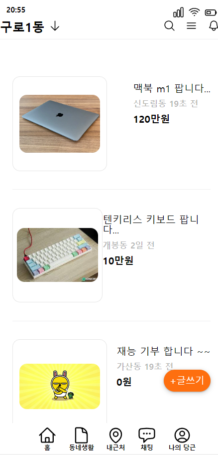

## 🥕당근마켓 UI작성

- [basic style 삭제 라이브러리](https://meyerweb.com/eric/tools/css/reset/)
- [아이콘 사이트](https://heroicons.com/)

### css 클래스 작성 규칙

하위 컴포넌트를 작성할 때는 `xxx__items`으로 언더바를 사용한다.

### 유용한 스타일

```css
justify-content: space-between;
```

<center>
<h2>당근마켓 UI 작성</h2>
    
</center>
