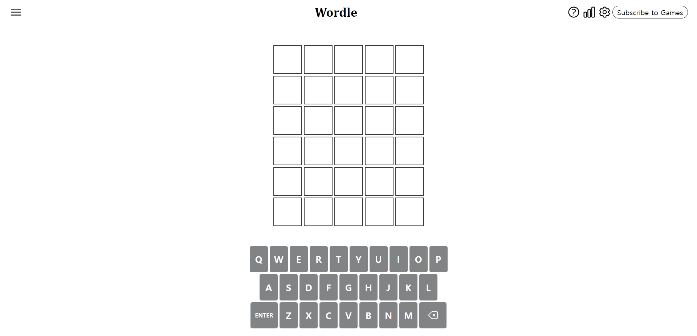
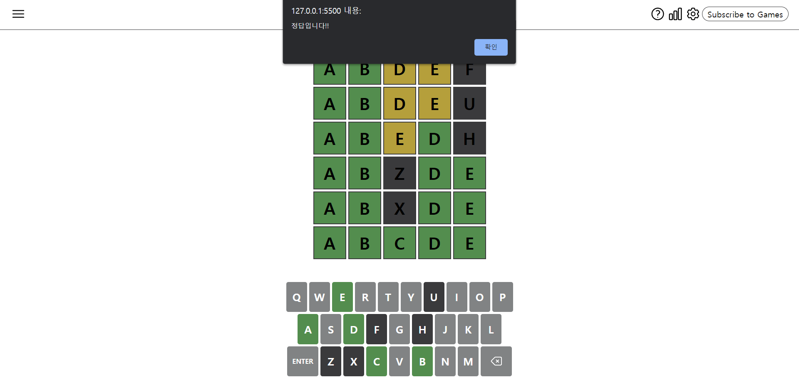
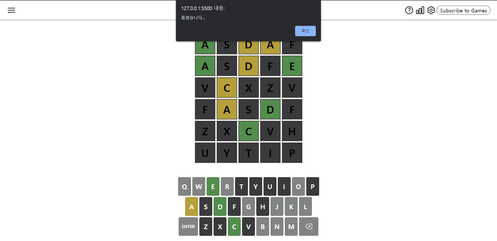

### Wordle

[배포 사이트](https://woodle.netlify.app)

### 유용한 옵션

```css
flex-grow: 2;
```

```javascript
const thisBlock = document.querySelector(`.board-block="$[data-index]"`);
```

class명과 필드를 이용해서 태그를 가져올 수 있다.

### 📜 기능 명세서

- [x] 5개 단어를 입력하고 Enter를 쳤을 때

  - [x] 알파뱃 저장
  - [x] 해당 알파뱃 가질 때
  - [x] 알파뱃 자리 일치할 때
  - [x] 정답 여부에 따라 색깔 변경

- [x] 키보드 입력 색깔 변경
- [x] 정답 시 게임 종료
- [x] 게임 종료시 오답 alert 발생
- [x] 키보드 클릭시 입력값 전달
- [x] 키보드 마우스 올리면 애니메이션
- [x] 실행시간 체크

## 결과 페이지

### 시작 페이지



### 진행중


### 성공



### 실패


